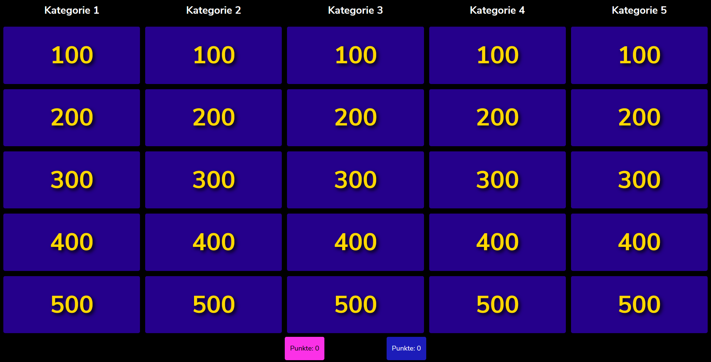
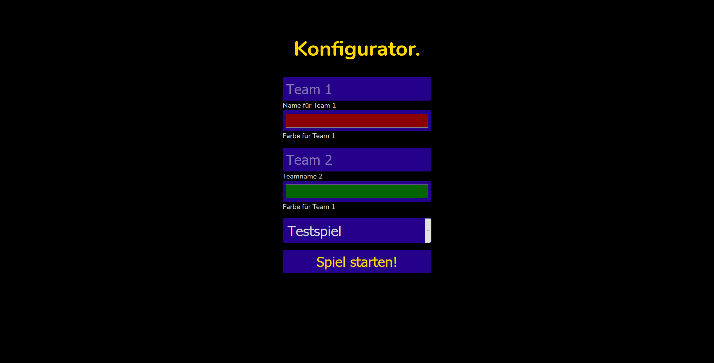

# Gefahr! (engl. jeopardy)
Naja, auf Englisch klingt das irgendwie besser.

## Was ist das hier?
Ich wollte ein einfach wiederholbares Quizspiel haben. Also habe ich mir etwas bekanntes nachgebaut. Nachdem mir jemand PHP in objekt-orientiert beigebracht hat, ist es leicht eskaliert.



## Vorraussetzung
Du musst PHP installiert haben. Oder der Server, auf dem du dass hier laufen lassen möchtest.\
[Hier kannst du PHP herunterladen.](https://www.php.net/downloads.php)

## Wie verwende ich es?
### Spiel starten
Eigentlich ganz einfach:
1. Spieldatei im Ordner "Spiele" erstellen\
   Dazu: `Testspiel.xml` kopieren und eigene Fragestellungen, Antworten und Werte eintragen\
   _Hinweis: Bisher funktionieren für die Werte lediglich ganze Zahlen. (#5)_
2. In `start.bat` die IP-Adresse und Port festlegen, unter der der Server erreichbar sein soll.
   ```batch script
   localhost:8000 -> ipadresse:port
   ```
3. `start.bat` ausführen.
4. Im Browser `http://ipadresse:port/game.php` aufrufen.
5. Spiel konfigurieren.\
   
6. Los geht's!

### Mitspieler Buzzern! lassen
Die Mitspieler müssen einfach nur `http://ipadresse:port/` aufrufen und ihr Team auswählen.